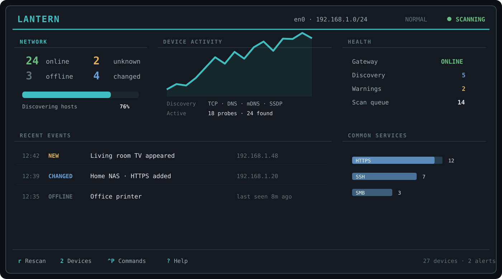
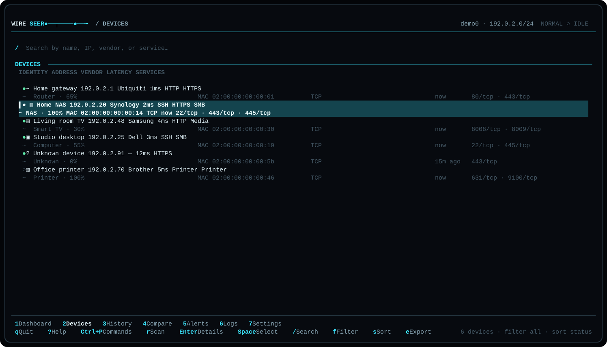
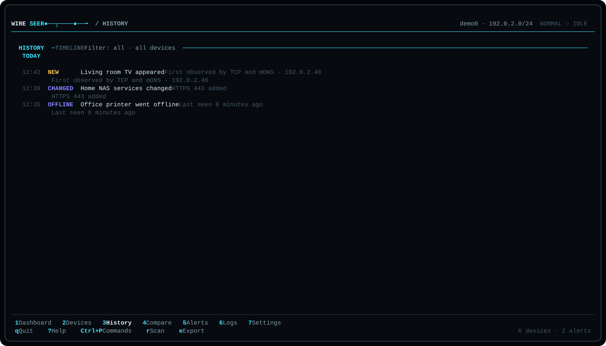

# Wireseer

```text
WIRESEER  ●──┬────●──╼
          local signal intelligence
```



_Rendered by Wireseer's real TUI from the network-free demo state. Every address, hostname,
identifier, event, and alert in the screenshots is mock data._

Wireseer is local signal intelligence for networks you own or are authorized to inspect. It
discovers devices, preserves the evidence behind their identity, and makes changes visible without
turning your terminal into a noisy security-dashboard cliché. It combines an asynchronous scanner,
explainable device fingerprints, durable SQLite history, baseline comparisons, alerts, and a
responsive keyboard-driven interface.

Wireseer does not call `nmap`, `arp`, `ping`, `netstat`, `ip`, or `ifconfig`. Discovery data stays
on the machine where Wireseer runs.

## Highlights

- Designed TUI with wide, standard, compact, and safe undersized-terminal layouts.
- Incremental discovery while the UI remains responsive.
- Conservative TCP connect profiles with bounded concurrency, per-attempt timeouts, and
  immediate cancellation.
- Local-interface, Linux neighbor-cache, mDNS DNS-SD, SSDP/UPnP, and reverse-DNS observations.
- Optional HTTP metadata from one bounded `GET /`; no login, path guessing, crawling, or
  redirect following.
- Facts retain their discovery source; inferred device types show weighted evidence and never
  masquerade as confirmed identity.
- SQLite inventory, address/service state, global timeline, scan diff, and named baseline.
- Fuzzy device search and command palette, coarse status filters, sorting, multi-selection,
  mouse wheel support, and contextual help.
- Eleven built-in themes: Wireseer Dark, Catppuccin Mocha/Latte, Dracula, Nord, Midnight Blue,
  Acid, Paper Light, High Contrast, Monochrome, and Color-Blind Friendly.
- Nerd Font, Unicode, and strict ASCII icon modes. Meaning never depends on an icon or color.
- JSON/XML/CSV export for devices, history, alerts, baselines, and comparisons; structured file
  logging; and a detailed `doctor` command.

## Discovery support

| Provider | Linux | Windows | macOS | Notes |
| --- | --- | --- | --- | --- |
| Local interface | yes | yes | yes | Portable IPv4 enumeration |
| TCP connect | yes | yes | yes | Conservative fixed profiles; no SYN/raw scan |
| Reverse DNS | yes | yes | yes | Uses the configured system resolver |
| mDNS / DNS-SD | yes | yes | yes | One service-enumeration multicast query; may degrade if port 5353 cannot be shared |
| SSDP / UPnP | yes | yes | yes | One bounded M-SEARCH request |
| ARP neighbors | yes | graceful | graceful | Linux reads `/proc/net/arp`; other platforms continue without it |
| ICMP | graceful | graceful | graceful | Raw adapter is not enabled; ICMP silence is never treated as offline proof |
| NetBIOS | graceful | graceful | graceful | Reserved provider boundary, currently disabled |
| TLS metadata | graceful | graceful | graceful | Model and persistence are ready; certificate adapter is not enabled |

“Graceful” means the provider reports an actionable status while every other provider continues.
Run `wireseer doctor` on the target machine for the authoritative capability report.

## Install

Homebrew is the primary distribution path for macOS and Linux. Once the project tap is published:

```bash
brew install mr-lexus/tap/wireseer
wireseer doctor
wireseer
```

Every tagged release also publishes ready-to-run archives for Intel and Apple Silicon macOS,
x86-64 and ARM64 Linux (GNU and static musl), and x86-64 and ARM64 Windows. Each release includes
`SHA256SUMS` and, for a public GitHub repository, verifiable build provenance.

To build the current source with Rust 1.85 or newer:

```bash
cargo install --locked --path .
```

Linux, Windows, and macOS are first-class targets. SQLite is built into the binary through
`rusqlite`'s bundled SQLite feature. No system SQLite package or scanning executable is needed.
See [docs/INSTALLATION.md](docs/INSTALLATION.md) for Homebrew, release binaries, checksum and
provenance verification, Cargo, platform, upgrade, and uninstall details.

## Screenshots

| Device inventory | History |
| --- | --- |
|  |  |

The committed screenshots are generated by `cargo run --example render_screenshots` from the
built-in `demo_state`. That mode disables automatic discovery, uses the IETF documentation subnet
`192.0.2.0/24`, and never reads a real inventory. See [docs/RELEASING.md](docs/RELEASING.md) for the
release screenshot check.

## Start here

Open the interactive application:

```bash
wireseer
```

Wireseer selects the most likely active IPv4 interface and begins a normal scan. Devices appear
as soon as a provider returns positive evidence. Press `r` to rescan, `x` to cancel, `2` for the
device workspace, or `Ctrl+P` to discover commands.

For a non-interactive scan:

```bash
wireseer scan
wireseer scan --interface eth0
wireseer scan --subnet 192.168.1.0/24 --mode quick
wireseer scan --mode deep --format json
```

The subnet safety limit defaults to 1,024 hosts. A larger configured subnet is rejected before
any probe begins. Increase `host_limit` deliberately if your authorized network requires it.

Watch mode repeats only after the configured interval and after the previous scan has finished:

```bash
wireseer watch
```

## Keyboard reference

Global navigation is consistent across screens.

The first footer row always shows all seven numbered workspaces and highlights the active one,
so navigation does not have to be memorized. The second row always starts with `q Quit`, `? Help`,
`Ctrl+P Commands`, and either `r Scan` or `x Cancel scan`; screen-specific actions follow when
space allows. Global actions have priority and remain visible at every supported terminal width.

`Ctrl+P` opens the complete command catalogue: type to filter it, use arrows or `j`/`k` to move,
`Home`/`End` and `PageUp`/`PageDown` for longer jumps, then press `Enter`. The palette scrolls
with the selection and shows both the visible range and the total command count.

| Key | Action |
| --- | --- |
| `1` … `7` | Dashboard, Devices, History, Compare, Alerts, Logs, Settings |
| `Ctrl+P` | Command palette with fuzzy action search |
| `?` | Contextual help |
| `j` / `k`, arrows | Next / previous item |
| `g` / `G`, Home / End | First / last item |
| `r` | Start a scan |
| `x` | Cancel the active scan |
| `q` | Quit; confirms when a scan is active |
| `Esc` | Close the top layer or return |

Device workspace:

| Key | Action |
| --- | --- |
| `Enter` | Open the selected inspector |
| `Space` | Toggle multi-selection |
| `/` | Fuzzy search across name, hostname, IP, MAC, vendor, and service names |
| `f` | Cycle all / online / offline / unknown / changed |
| `s` | Cycle status / name / address / vendor / latency / last-seen / confidence sort |
| `e` | Export guidance |

Device details:

| Key | Action |
| --- | --- |
| e | Confirm an exact identity/model locally, or clear it to restore automatic detection |
| t | Edit local tags |
| n | Edit a local note |

Settings:

| Key | Action |
| --- | --- |
| `j/k`, arrows, `Home/End` | Move through editable settings |
| `Enter` / `Space` | Change the selected setting |
| `t` | Open theme picker with live preview |
| `i` | Cycle Nerd Font / Unicode / ASCII icons |
| `a` | Toggle animation |
| `m` | Cycle scan mode |
| `c` | Switch between Detailed and Compact device rows |
| `s` | Confirm persistence on clean exit |

Detailed rows use the second line for device type and confidence, a MAC/interface hint, discovery
sources, last-seen age, and service endpoints. Compact rows keep the primary identity, address,
vendor, latency, and service names on one line. The selected density is persisted.

The device workspace responds to its actual width rather than only the terminal breakpoint.
On narrow windows the table keeps the full workspace and hides lower-priority columns before
identity or address become unusable. As space grows, services, vendor, and confidence return and
all flexible columns expand continuously. The inspector appears only when the table retains a
usable width and is capped on very wide terminals.

With mouse input enabled, click the numbered footer to switch screens, click settings to change
them, and use the wheel over device lists and menus. A device row is selected on the first click
and opened on the next; middle-click toggles multi-selection and right-click acts like `Esc`.
The mouse setting takes effect immediately.

Dialogs trap focus. `Esc` always closes the topmost overlay before affecting its underlying page.

## CLI

```text
wireseer [--icons nerd|unicode|ascii]
wireseer scan [--interface NAME] [--subnet CIDR] [--mode MODE] [--format table|json|xml|csv] [--output PATH]
wireseer watch [--interface NAME] [--subnet CIDR] [--mode MODE]
wireseer devices [--online] [--format table|json|xml|csv] [--output PATH]
wireseer history [--limit N] [--format table|json|xml|csv] [--output PATH]
wireseer alerts [--open] [--format table|json|xml|csv] [--output PATH]
wireseer export --kind devices|history|alerts|baseline|comparison --format json|xml|csv [--output PATH]
wireseer baseline create [--name NAME]
wireseer baseline compare
wireseer vendor update
wireseer vendor import PATH
wireseer vendor status
wireseer config path
wireseer config show
wireseer config init [--force]
wireseer doctor
```

Table output is intended for people. JSON, XML, and CSV output contains no headings, progress
messages, or decorations outside the selected serialization, so it can be piped directly into
`jq`, import tools, or another process. `--output -` is equivalent to stdout; any other path is
created or replaced. Successful file exports are silent. Errors go to stderr and return a nonzero
exit status. CSV files always contain headers, including when a query returns no records.

See [docs/CLI.md](docs/CLI.md) for the output contract, XML roots, and automation examples.

CLI help is currently English-only. Use `wireseer <command> --help` for the exact options compiled
into your version. A terminal
does not expose whether its active font contains Nerd Font private-use glyphs, so Wireseer never
enables them speculatively. Unicode is the safe default. Use `--icons nerd` for one run, set
`WIRESEER_ICONS=nerd` in a terminal profile, or persist `icons = "nerd"` only after selecting a
Nerd Font in that terminal.

## Configuration

Wireseer follows the platform configuration directories exposed by the operating system. Find
the exact path with:

```bash
wireseer config path
wireseer config init
wireseer config show
```

See [config/wireseer.example.toml](config/wireseer.example.toml) for every stable setting and
[docs/CONFIGURATION.md](docs/CONFIGURATION.md) for behavior and safety limits.

The built-in defaults are intentionally moderate: normal mode, 96 concurrent connect attempts,
220 ms connect timeout, `/24`-friendly host limits, 30-second watch interval, SSDP/mDNS once per
scan, and HTTP/TLS metadata disabled.

## History and baselines

Each positive observation updates a stable device snapshot and its service/address timestamps.
After a completed scan, previously online devices without any observation in that scan transition
to offline. A device is never marked offline merely because it ignored ICMP.

Create a known-network baseline after reviewing the inventory:

```bash
wireseer baseline create --name "Home network"
wireseer baseline compare
```

The comparison separates unknown, missing, and changed devices. Baseline-unknown rows receive a
visible `!` marker even in monochrome and ASCII modes.

## Offline MAC vendor data

Wireseer never sends a MAC address to a lookup API. Download and install the official IEEE MA-L,
MA-M, and MA-S public registries with:

```bash
wireseer vendor update
wireseer vendor status
```

The update downloads the registry files once, validates them, and stores the combined database
locally. To use another source instead, import an IEEE assignment CSV or a simple text file
containing `AA:BB:CC Vendor Name` lines:

```bash
wireseer vendor import oui.csv
```

The file is validated before it replaces the local copy, longest-prefix matching is supported,
and loading happens away from the render loop. Manufacturer, hostname, advertised services, open
ports, and optional HTTP metadata are combined to infer a device type. Randomized/private MACs
have no public vendor assignment, so hostname and service evidence remain important.

Wireseer keeps the broad type, inferred product family, platform, and supporting evidence separate.
For example, a hostname can support MacBook Pro or Apple iPhone, but it cannot prove an M1 chip
or an iPhone generation. Press e in device details to store an exact, user-confirmed identity;
that local value takes precedence and is never replaced by automatic inference. Ambiguous appliance
families stay generic until confirmed instead of borrowing a product category from a vendor name.
An unknown
prefix remains `Unknown`; it is not an error and does not trigger a lookup request during scans.

## Permissions

Ordinary TCP, DNS, SSDP, mDNS, and interface enumeration should not require administrator/root
access. On Linux, Wireseer reads the kernel's public ARP neighbor table. Raw ICMP is not used by
the default build, so elevated privileges are neither required nor recommended.

Local firewalls can block multicast or outbound connects. Wireseer reports the affected provider
as degraded and continues. It does not attempt to bypass policy.

## Security and privacy

Only use Wireseer on networks you own or are explicitly authorized to inspect.

- No exploitation, authentication, credential use, brute force, stealth behavior, packet flood,
  form submission, path enumeration, or arbitrary command execution.
- TCP discovery uses the operating system's normal connect API.
- HTTP collection is opt-in, requests only `/`, reads at most 16 KiB, and follows zero redirects.
- Concurrency, timeouts, scan intervals, port sets, and subnet size are bounded and configurable.
- Discovered IPs, MACs, hostnames, services, notes, tags, and history stay in local files.
- Logs avoid packet bodies and never include credentials because Wireseer never collects them.
- Cancellation is propagated to active providers; shutdown flushes the history writer and restores
  raw mode, alternate screen, mouse capture, and cursor state.

See [SECURITY.md](SECURITY.md) for threat boundaries and responsible reporting.

## Troubleshooting

Run `wireseer doctor` first. It checks configuration, IPv4 interfaces/subnets, provider support,
database access, the vendor file, terminal color/Unicode hints, and the selected icon mode.

Common cases:

- **No usable interface:** specify `--interface`, or set `interface` in TOML. VPN and container
  adapters can otherwise look more active than the desired LAN.
- **Subnet rejected:** the CIDR exceeds `host_limit`. Use a narrower authorized CIDR rather than
  raising the limit casually.
- **mDNS degraded:** another daemon may prevent sharing UDP port 5353. TCP, DNS, ARP-cache, and
  SSDP discovery continue.
- **Few devices found:** many appliances expose no configured TCP service. Let mDNS/SSDP complete,
  interact with devices normally so the OS neighbor cache is populated, then rescan.
- **No colors despite a selected theme:** Wireseer treats an explicit color theme as authoritative
  inside the TUI and overrides an inherited non-empty `NO_COLOR`. Choose Monochrome when colorless
  output is intentional; `wireseer doctor` reports conflicts and terminals with `TERM=dumb`.
- **Garbled icons:** return to safe Unicode with `--icons unicode`, or select ASCII from Settings.
  Use Nerd mode only after configuring a Nerd Font in the active terminal profile.
- **Interrupted terminal:** modern shells usually recover with `reset`; please report any path
  that bypasses Wireseer's restoration guard.

Structured logs are stored beside the SQLite database. The exact platform paths are printed by
`wireseer config path` and `wireseer doctor`.

## Architecture and development

The complete data flow, visual system, screen mockups, breakpoints, provider/event contracts,
SQLite schema, and phased checklist live in [docs/PRODUCT.md](docs/PRODUCT.md). A shorter code map
is in [docs/ARCHITECTURE.md](docs/ARCHITECTURE.md).

Contributions are welcome; start with [CONTRIBUTING.md](CONTRIBUTING.md). Tests use documentation
addresses and in-memory SQLite, never the developer's LAN.

## Documentation

- [Installation and upgrades](docs/INSTALLATION.md)
- [User guide](docs/USER_GUIDE.md)
- [CLI and machine-output contract](docs/CLI.md)
- [Configuration reference](docs/CONFIGURATION.md)
- [Architecture overview](docs/ARCHITECTURE.md)
- [Security and privacy boundaries](SECURITY.md)
- [Release and Homebrew publishing guide](docs/RELEASING.md)
- [Changelog](CHANGELOG.md)

## License

MIT — see [LICENSE](LICENSE).
